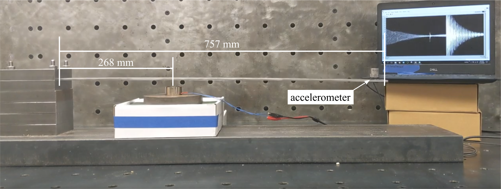
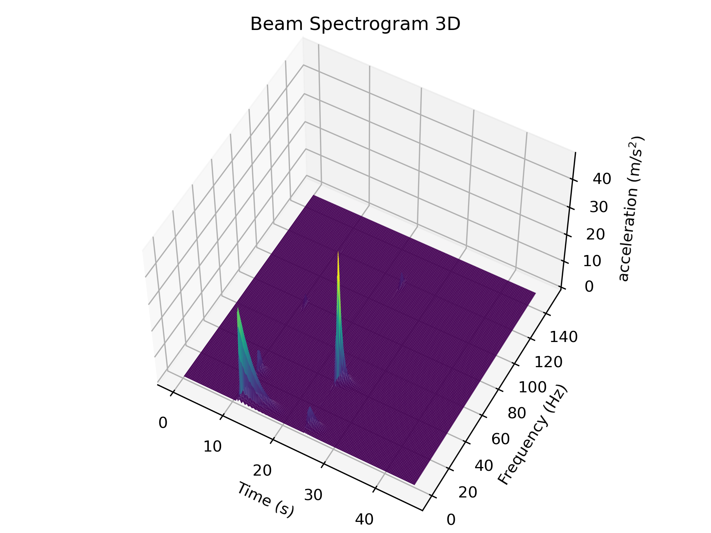
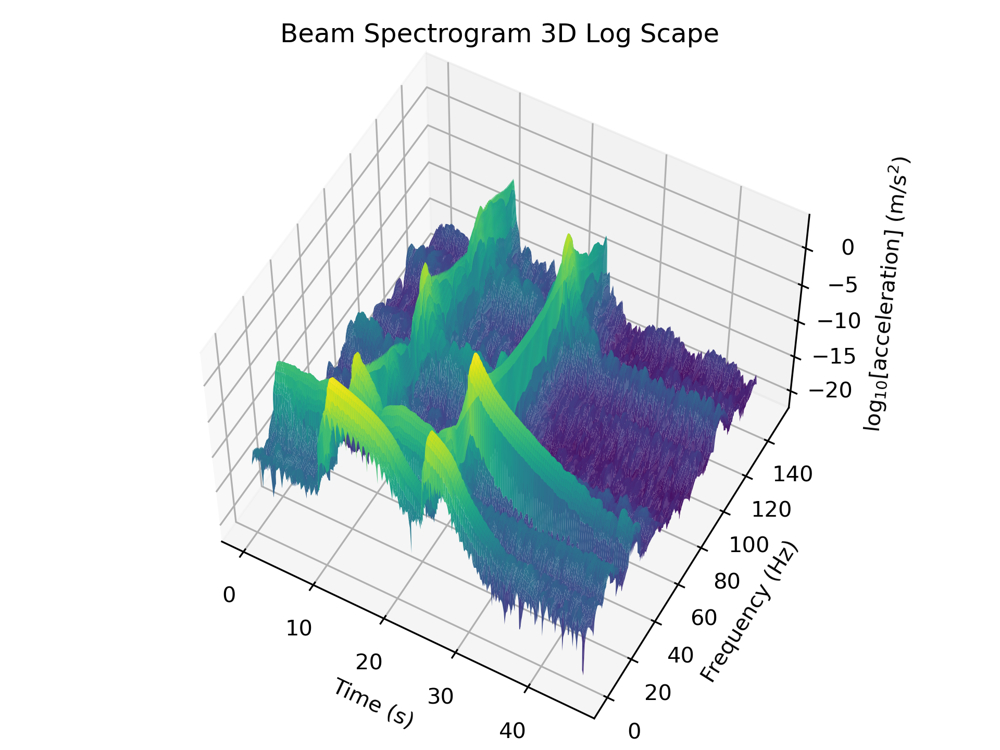

# Data

This folder contains vibration data for a cantilever beam as shown below. 

Dimensions of the beam as tested.

The time-frequency response of the beam is shown in the spectrogram of the system below.

3D Spectrogram of the beam.

3D Spectrogram of the beam in log base 10 scale.

