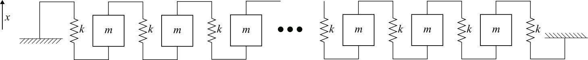

# EOM code with numerical solver

	The undamped spring-mass system used in this work to model a simply supported beam.

	Spatial-temporal response of the beam when continuously excited at the frequency of the first mode.

	Spatial-temporal response of the beam when continuously excited at the frequency of the secod mode.

	Spatial-temporal response of the beam when continuously excited at the frequency of the third mode.

